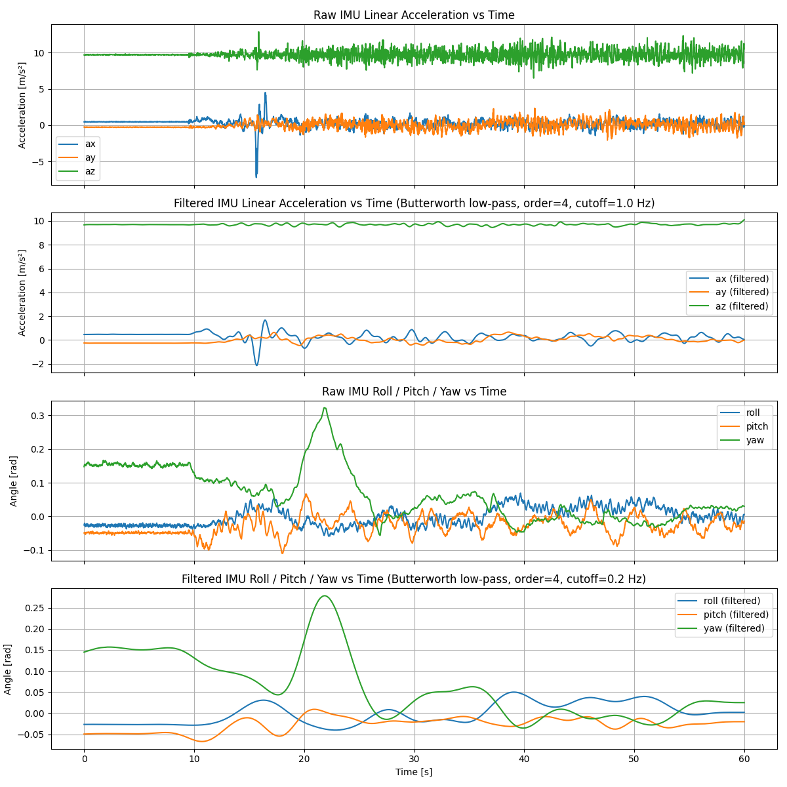

# Setting the Frequency Cutoff for a Butterworth Filter using Plotjuggler
## 0. Intro
Plotjuggler is a time series visualisation tool for ros2 bagfiles. In the following, we'll use it to do some frequency analysis on the IMU data from this tutorial. Note that this is not installed in the labs, but can be installed using conda and robostack
## 1. Loading a bag into plotjuggler
* Run plotjuggler
```Bash
ros2 run plotjuggler plotjuggler
```


* To load a bagfile
	* data -> <path_to_bagfile> -> metadata.yaml -> open
* Click through this message, these topics are not required 
* Select the two IMU topics and click ok 
 

* tools -> fast forier transform 
* Drag and drop roll, pitch and yaw  
 

---
## 2. Orientation Analysis

* Most of the signal is at less than ~0.3 HZ 
* It is difficult to separate robot motion from sensor noise and bias at these frequencies
* We can also see a DC component on all 3 axis - This includes bias term


### 2.1 Zooming in
In order to remove the effects of vehicle motion on the analysis, we zoom in on  on the region of the graph where the robot is not moving, We see;
* DC offset as frequency -> zero
    * This is a more accurate reflection of the Bias term
* No clear higher frequency interference, but there is white noise


---
## 3. Acceleration Analysis
Next we do a fft on the acceleration data.
Note that gravity in the z component dominates the FFT graph, so we disable it in most of the visualisations.
In a similar way to 2, we see a combination of signal and noise between 0 and 3 Hz, then noise in higher frequency responses.


## 3.1. Zooming in
Zooming in on the stationary part of the graph, 
* we can see a dc offset terms as the frequency approaches zero.
	* This represents a combination of the gravity vector in the z component, as well as the bias term.
* We can also see the noise floor, which is independent of frequency


## 4. Setting frequency cutoffs for the butter filter

Low pass filters may help remove high frequency noise, but not with removing the bias. Much of the energy when the vehicle is in motion is at low frequencies, so we will not see much change in the signal if we just filter the noise floor. From the lab, if we set the low pass filter for accel to 1 hz and rotation to 0.2 hz, we see significant smoothing of the signal from the IMU, however this may not be the best approach to filtering since we are in part attenuating the IMU response to the robot's motion.


